Flchain Exploratory Data Analysis
================

R
-

------------------------------------------------------------------------

**Author :** Matheus Willian Machado
**Date :** May 16, 2018

------------------------------------------------------------------------

Project Overview
----------------

> Use R and apply exploratory data analysis techniques to explore relationships in one to multiple variables and to explore a set of selected data, their distributions, outliers, and anomalies.

------------------------------------------------------------------------

Introduction
------------

The **flchain dataset** is a sample of Olmsted County residents with 50 years or more.
From a study of the relationship between serum free light chain(FLC) and mortality.
This data frame contains **7874 rows** and the following **11 columns**:

-   **age:** age in years.
-   **sex:** F=female, M=male.
-   **sample.yr:** the calendar year in which a blood sample was obtained.
-   **kappa:** serum free light chain, kappa portion.
-   **lambda:** serum free light chain, lambda portion.
-   **flc.grp:** the FLC group for the subject, as used in the original analysis.
-   **creatinine:** serum creatinine.
-   **mgus:** 1 if the subject had been diagnosed with monoclonal gammapothy (MGUS).
-   **futime:** days from enrollment until death. Note that there are 3 subjects whose sample was obtained on their death date.
-   **death:** 0=alive at last contact date, 1=dead.
-   **chapter:** for those who died, a grouping of their primary cause of death by chapter headings of the International Code of Diseases ICD-9.

It's possible to get more information about the dataset with `?flchain` or [here](https://stat.ethz.ch/R-manual/R-devel/library/survival/html/flchain.html "R: Assay of serum free light chain for 7874 subjects").

> In 1995 Dr. Robert Kyle embarked on a study to determine the prevalence of monoclonal gammopathy of undetermined significance (MGUS) in Olmsted County, Minnesota, a condition which is normally only found by chance from a test (serum electrophoresis) which is ordered for other causes. Later work suggested that one component of immunoglobulin production, the serum free light chain, might be a possible marker for immune disregulation. In 2010 Dr. Angela Dispenzieri and colleagues assayed FLC levels on those samples from the original study for which they had patient permission and from which sufficient material remained for further testing. They found that elevated FLC levels were indeed associated with higher death rates.
>
> Patients were recruited when they came to the clinic for other appointments, with a final random sample of those who had not yet had a visit since the study began. An interesting side question is whether there are differences between early, mid, and late recruits.
>
> This data set contains an age and sex stratified random sample that includes 7874 of the original 15759 subjects. The original subject identifiers and dates have been removed to protect patient identity. Subsampling was done to further protect this information.
>
> (R Documentation)

Based on the details above, three points were selected for analysis:

[ ] FLC as a MGUS marker.
[ ] Differences between early, mid, and late recruits.
[ ] Association between FLC and higher death rates.

------------------------------------------------------------------------

``` r
# Load libraries
library(survival)
library(ggplot2)
library(GGally)
library(dplyr)
```

------------------------------------------------------------------------

Dataset
-------

``` r
# Load and show dataset
data <- flchain
head(data, 10)
```

    ##    age sex sample.yr kappa lambda flc.grp creatinine mgus futime death
    ## 1   97   F      1997 5.700  4.860      10        1.7    0     85     1
    ## 2   92   F      2000 0.870  0.683       1        0.9    0   1281     1
    ## 3   94   F      1997 4.360  3.850      10        1.4    0     69     1
    ## 4   92   F      1996 2.420  2.220       9        1.0    0    115     1
    ## 5   93   F      1996 1.320  1.690       6        1.1    0   1039     1
    ## 6   90   F      1997 2.010  1.860       9        1.0    0   1355     1
    ## 7   90   F      1996 0.430  0.880       1        0.8    0   2851     1
    ## 8   90   F      1999 2.470  2.700      10        1.2    0    372     1
    ## 9   93   F      1996 1.910  2.180       9        1.2    0   3309     1
    ## 10  91   F      1996 0.791  2.220       6        0.8    0   1326     1
    ##        chapter
    ## 1  Circulatory
    ## 2    Neoplasms
    ## 3  Circulatory
    ## 4  Circulatory
    ## 5  Circulatory
    ## 6       Mental
    ## 7       Mental
    ## 8      Nervous
    ## 9  Respiratory
    ## 10 Circulatory

``` r
str(data)
```

    ## 'data.frame':    7874 obs. of  11 variables:
    ##  $ age       : num  97 92 94 92 93 90 90 90 93 91 ...
    ##  $ sex       : Factor w/ 2 levels "F","M": 1 1 1 1 1 1 1 1 1 1 ...
    ##  $ sample.yr : num  1997 2000 1997 1996 1996 ...
    ##  $ kappa     : num  5.7 0.87 4.36 2.42 1.32 2.01 0.43 2.47 1.91 0.791 ...
    ##  $ lambda    : num  4.86 0.683 3.85 2.22 1.69 1.86 0.88 2.7 2.18 2.22 ...
    ##  $ flc.grp   : num  10 1 10 9 6 9 1 10 9 6 ...
    ##  $ creatinine: num  1.7 0.9 1.4 1 1.1 1 0.8 1.2 1.2 0.8 ...
    ##  $ mgus      : num  0 0 0 0 0 0 0 0 0 0 ...
    ##  $ futime    : int  85 1281 69 115 1039 1355 2851 372 3309 1326 ...
    ##  $ death     : num  1 1 1 1 1 1 1 1 1 1 ...
    ##  $ chapter   : Factor w/ 16 levels "Blood","Circulatory",..: 2 13 2 2 2 11 11 14 15 2 ...

``` r
summary(data)
```

    ##       age         sex        sample.yr        kappa       
    ##  Min.   : 50.00   F:4350   Min.   :1995   Min.   : 0.010  
    ##  1st Qu.: 55.00   M:3524   1st Qu.:1996   1st Qu.: 0.960  
    ##  Median : 63.00            Median :1996   Median : 1.270  
    ##  Mean   : 64.29            Mean   :1997   Mean   : 1.431  
    ##  3rd Qu.: 72.00            3rd Qu.:1997   3rd Qu.: 1.680  
    ##  Max.   :101.00            Max.   :2003   Max.   :20.500  
    ##                                                           
    ##      lambda          flc.grp         creatinine          mgus       
    ##  Min.   : 0.040   Min.   : 1.000   Min.   : 0.400   Min.   :0.0000  
    ##  1st Qu.: 1.200   1st Qu.: 3.000   1st Qu.: 0.900   1st Qu.:0.0000  
    ##  Median : 1.510   Median : 5.000   Median : 1.000   Median :0.0000  
    ##  Mean   : 1.703   Mean   : 5.471   Mean   : 1.093   Mean   :0.0146  
    ##  3rd Qu.: 1.920   3rd Qu.: 8.000   3rd Qu.: 1.200   3rd Qu.:0.0000  
    ##  Max.   :26.600   Max.   :10.000   Max.   :10.800   Max.   :1.0000  
    ##                                    NA's   :1350                     
    ##      futime         death               chapter    
    ##  Min.   :   0   Min.   :0.0000   Circulatory: 745  
    ##  1st Qu.:2852   1st Qu.:0.0000   Neoplasms  : 567  
    ##  Median :4302   Median :0.0000   Respiratory: 245  
    ##  Mean   :3661   Mean   :0.2755   Mental     : 144  
    ##  3rd Qu.:4773   3rd Qu.:1.0000   Nervous    : 130  
    ##  Max.   :5215   Max.   :1.0000   (Other)    : 338  
    ##                                  NA's       :5705

The dataset used is from survival package. It was copied to variable "data" and shown its:

-   First ten lines.
-   Dataframe rows(observations) and columns(variables).
-   Name, data type and some values, for each variable.

Lastly, summaries were given.

------------------------------------------------------------------------

Data Transformations
--------------------

``` r
# Change bad names
names(data)[names(data) == "sample.yr"] <- 'sample.year'
names(data)[names(data) == "flc.grp"] <- 'flc.group'
names(data)
```

    ##  [1] "age"         "sex"         "sample.year" "kappa"       "lambda"     
    ##  [6] "flc.group"   "creatinine"  "mgus"        "futime"      "death"      
    ## [11] "chapter"

The variable names "sample.yr" and "flc.grp" were adjusted to fit the Google's Style R Guide.

``` r
# Adjust abbreviated levels
levels(data$sex) <- c('Female', 'Male')
levels(data$sex)
```

    ## [1] "Female" "Male"

For a better reading and display of plots legend, sex factor levels were changed to "Female" and "Male", respectively.

``` r
# Cast to Factor
data$flc.group <- as.factor(data$flc.group)
```

Since FLC groups values are just labels, its data type was modified to factor.

``` r
# Reduce many levels Factor
sort(table(data$chapter))
```

    ## 
    ##           Congenital                Blood                 Skin 
    ##                    3                    4                    4 
    ##      Musculoskeletal Injury and Poisoning           Infectious 
    ##                   14                   21                   32 
    ##          Ill Defined        Genitourinary            Endocrine 
    ##                   38                   42                   48 
    ##            Digestive      External Causes              Nervous 
    ##                   66                   66                  130 
    ##               Mental          Respiratory            Neoplasms 
    ##                  144                  245                  567 
    ##          Circulatory 
    ##                  745

``` r
cat('5% of non-NA values: ', sum(!is.na(data$chapter)) * 0.05)
```

    ## 5% of non-NA values:  108.45

``` r
chapter <- c('Circulatory', 'Neoplasms', 'Respiratory', 'Mental', 'Nervous')
levels(data$chapter)[!levels(data$chapter) %in% chapter] <- 'Others'
sort(table(data$chapter))
```

    ## 
    ##     Nervous      Mental Respiratory      Others   Neoplasms Circulatory 
    ##         130         144         245         338         567         745

Chapter variable had sixteen levels initially.
Note that most represents less than 5% of the non-NA values.
So this less representative part was joined into a "Others" label.

``` r
# Convert boolean to Factor
unique(data$mgus)
```

    ## [1] 0 1

``` r
unique(data$death)
```

    ## [1] 1 0

``` r
data$mgus <- factor(data$mgus,
                    labels = c('non-mgus', 'mgus'))
data$death <- factor(data$death,
                     labels = c('alive', 'dead'))
```

Variables "mgus" and "death" were tested to confirm if they are boolean.
As both had only two values, they were encoded as factors and labeled.

``` r
# Test and convert num to int
all(data$age == round(data$age))
```

    ## [1] TRUE

``` r
all(data$sample.year == round(data$sample.year))
```

    ## [1] TRUE

``` r
all(data$futime == round(data$futime))
```

    ## [1] TRUE

``` r
data$age <- as.integer(data$age)
data$sample.year <- as.integer(data$sample.year)
data$futime <- as.integer(data$futime)
```

Columns "age", "sample.year" and "futime" was tested to confirm that all number are rounded.
With true for all of them, this variables were casted to integer.

``` r
# Cut variables
table(data$sample.year)
```

    ## 
    ## 1995 1996 1997 1998 1999 2000 2001 2002 2003 
    ## 1275 3491 1381  687  350  245  175   48  222

``` r
data$recruits <- cut(data$sample.year,
                     breaks = c(1994, 1997, 2000, 2003),
                     labels = c('early', 'middle', 'late'))
table(data$recruits)
```

    ## 
    ##  early middle   late 
    ##   6147   1282    445

"sample.year" has nine unique values.
It was necessary to separate the recruits into three groups: early, middle and late.
Thus, values were grouped every three years and stored in "recruits" variable.

``` r
# Create useful variables
data <- transform(data,
                  flc       = kappa + lambda,
                  flc.ratio = kappa / lambda)
```

To calculate the FLC levels, it is necessary to add the two kappa and lambda portions.
In addition, the Mayo Clinic has reported that the detection of monoclonal light chains depends on the ratio of free kappa and lambda (K/L) light chains.
More information about the [test](https://www.mayomedicallaboratories.com/test-catalog/Clinical+and+Interpretive/84190 "k/l ratio")

------------------------------------------------------------------------

Univariate Plots
----------------

``` r
# Age distribution
ggplot(data, aes(age)) +
  geom_histogram(binwidth = .5)
```

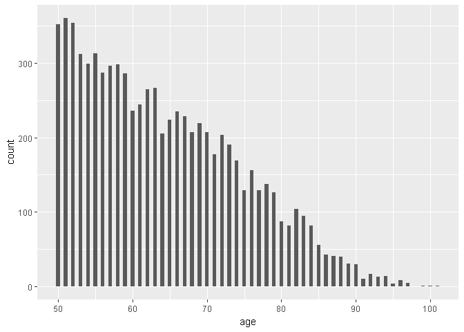

As age is a integer variable.
To see all frequencys, a small binwidth was chosen for the distribution.
It shows one column to each age in the histogram.
This distribution is concentrated around 50's and decreases over the years.

``` r
# Samples obtained in each year
ggplot(data, aes(sample.year)) +
  geom_histogram(binwidth = 1)
```

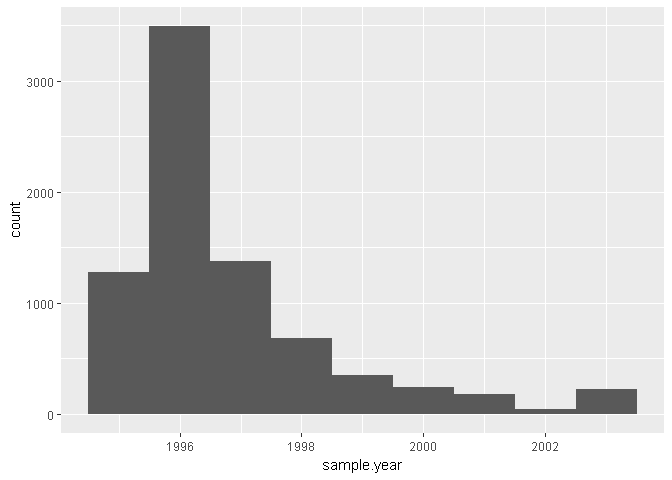

Because of the narrower range compared to age, a higher binwidth was prefered to this.
Most part is concentrate on the first three years.
To analyse the density, the scale y was replaced as the x variable to "recruits".

``` r
# Density of samples by epoch
ggplot(data, aes(recruits, (..count.. / sum(..count..)))) +
  geom_bar() +
  ylab('Frequency') +
  scale_y_continuous(breaks = seq(0, 1, .1))
```

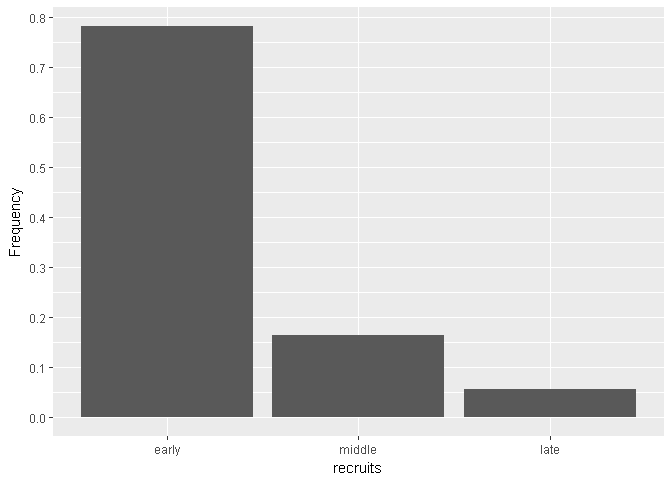

As expected, almost 80% of the sample was recruited within the first three years.
In contrast, only about 5% in the last three years.

``` r
# Frequency of kappa, lambda and creatinine sera
ggplot(data) +
  geom_freqpoly(aes(kappa,
                    color = 'kappa'),
                binwidth = .1) +
  geom_freqpoly(aes(lambda,
                    color = 'lambda'),
                binwidth = .1) +
  geom_freqpoly(aes(creatinine,
                    color = 'creatinine'),
                data     = subset(data, !is.na(creatinine)),
                binwidth = .1) +
  scale_colour_manual(name   = 'Sera',
                      breaks = c('creatinine', 'kappa', 'lambda'),
                      values = c('green', 'red', 'blue')) +
  xlab('kappa, lambda and creatinine')
```

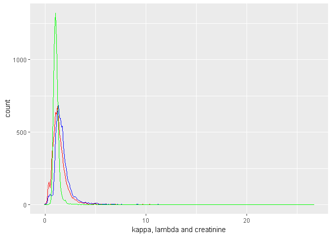

Serum variables were analyzed togheter.
Red was used for kappa, blue for lambda and creatinine green.
For a better understanding x-scale was transformed.

``` r
# Frequency of kappa, lambda and creatinine sera (log)
ggplot(data) +
  geom_freqpoly(aes(log(kappa),
                    color = 'kappa'),
                binwidth = .1) +
  geom_freqpoly(aes(log(lambda),
                    color = 'lambda'),
                binwidth = .1) +
  geom_freqpoly(aes(log(creatinine),
                    color = 'creatinine'),
                data = subset(data,!is.na(creatinine)),
                binwidth = .1) +
  scale_x_continuous(breaks = seq(-4, 4, .5)) +
  scale_colour_manual(name   = 'Sera',
                      breaks = c('creatinine', 'kappa', 'lambda'),
                      values = c('green', 'red', 'blue')) +
  xlab('Log of creatinine, kappa and lambda')
```

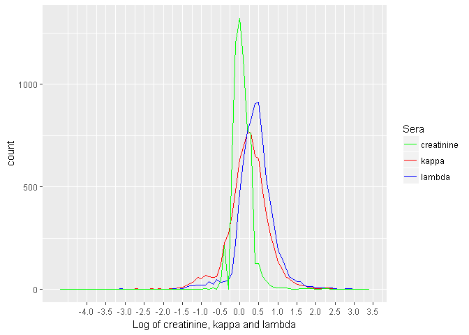

``` r
# Summaries of creatinine, kappa and lambda (log)
summary(log(data[,c('creatinine', 'kappa', 'lambda')]))
```

    ##    creatinine          kappa              lambda       
    ##  Min.   :-0.9163   Min.   :-4.60517   Min.   :-3.2189  
    ##  1st Qu.:-0.1054   1st Qu.:-0.04082   1st Qu.: 0.1823  
    ##  Median : 0.0000   Median : 0.23902   Median : 0.4121  
    ##  Mean   : 0.0540   Mean   : 0.22379   Mean   : 0.4228  
    ##  3rd Qu.: 0.1823   3rd Qu.: 0.51879   3rd Qu.: 0.6523  
    ##  Max.   : 2.3795   Max.   : 3.02042   Max.   : 3.2809  
    ##  NA's   :1350

Corroborating with the summaries, it's possible to see peaks near means.
Most values are close, as shows the 1st and 3rd quartiles.
Creatinine seems more concentrated and the others more diluted.

``` r
# Frequency of FLC level and ratio (log)
ggplot(data) +
  geom_freqpoly(aes(log(flc),
                    color = 'level'),
                binwidth = .1) +
  geom_freqpoly(aes(log(flc.ratio),
                    color = 'ratio'),
                binwidth = .1) +
  scale_x_continuous(breaks = seq(-4, 4, .5)) +
  scale_colour_manual(name   = 'FLC',
                      breaks = c('level', 'ratio'),
                      values = c('purple', 'orange')) +
  xlab('Log of FLC level and ratio')
```

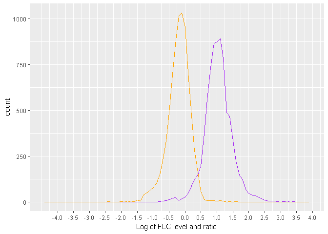

``` r
# Summaries of FLC level and ratio
summary(log(data[,c('flc.ratio', 'flc')]))
```

    ##    flc.ratio             flc        
    ##  Min.   :-4.27667   Min.   :-2.408  
    ##  1st Qu.:-0.38712   1st Qu.: 0.793  
    ##  Median :-0.16946   Median : 1.026  
    ##  Mean   :-0.19901   Mean   : 1.037  
    ##  3rd Qu.: 0.02513   3rd Qu.: 1.270  
    ##  Max.   : 3.71058   Max.   : 3.761

The level and ratio of Flc were analyzed together as well.
Purple to level and orange to the other.
As in the last plot blue was just before the red values, the orange peak before and near 0 and the purple one a bit ahead of 1 were expected.

``` r
# Distribution of flc.group
ggplot(data) +
  geom_bar(aes(flc.group)) +
  scale_y_continuous(breaks = seq(0, 800, 50))
```

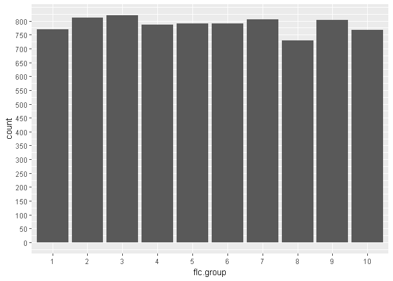

The last plot shows that the FLC groups have similar amounts.

------------------------------------------------------------------------

Univariate Analysis
-------------------

### What is the structure of your dataset?

Flchain structure is:

-   7874 rows.
-   11 columns.
-   8 numerical variables.
-   1 integer variable.
-   2 factor variables.
-   the median age is 63, but most of the values are concentrated in the 50's.
-   There are more female than male observations.
-   80% of the samples were obtained in the first 3 years.
-   Most creatinine levels are close to 1, while kappa and lambda are about 1.27 and 1.5, respectively.
-   FLC groups have similar amounts.

### What is/are the main feature(s) of interest in your dataset?

Based on the three objectives, main features are: + Kappa and Lambda portions. + Deaths and MGUS. + Sample.yr.

### What other features in the dataset do you think will help support your investigation into your feature(s) of interest?

I suspect that these features may have some influence on FLC levels:

-   age
-   sex
-   creatinine

Since the study of survival and the cause of death are not in the objectives, I will not analyze these factors below:

-   futime
-   chapter

### Did you create any new variables from existing variables in the data set?

Yes, the following variables were created to help achieve the objectives:

-   recruits, will replace sample.yr.
-   flc, will replace "kappa" and "lambda".
-   flc.ratio, will replace "kappa" and "lambda"

------------------------------------------------------------------------

Bivariate Plots
---------------

``` r
# Subseting data
data = data[, c("age", "creatinine", "flc", "flc.ratio", "flc.group", "sex", "mgus", "death", "recruits")]
head(data)
```

    ##   age creatinine    flc flc.ratio flc.group    sex     mgus death recruits
    ## 1  97        1.7 10.560 1.1728395        10 Female non-mgus  dead    early
    ## 2  92        0.9  1.553 1.2737921         1 Female non-mgus  dead   middle
    ## 3  94        1.4  8.210 1.1324675        10 Female non-mgus  dead    early
    ## 4  92        1.0  4.640 1.0900901         9 Female non-mgus  dead    early
    ## 5  93        1.1  3.010 0.7810651         6 Female non-mgus  dead    early
    ## 6  90        1.0  3.870 1.0806452         9 Female non-mgus  dead    early

``` r
str(data)
```

    ## 'data.frame':    7874 obs. of  9 variables:
    ##  $ age       : int  97 92 94 92 93 90 90 90 93 91 ...
    ##  $ creatinine: num  1.7 0.9 1.4 1 1.1 1 0.8 1.2 1.2 0.8 ...
    ##  $ flc       : num  10.56 1.55 8.21 4.64 3.01 ...
    ##  $ flc.ratio : num  1.173 1.274 1.132 1.09 0.781 ...
    ##  $ flc.group : Factor w/ 10 levels "1","2","3","4",..: 10 1 10 9 6 9 1 10 9 6 ...
    ##  $ sex       : Factor w/ 2 levels "Female","Male": 1 1 1 1 1 1 1 1 1 1 ...
    ##  $ mgus      : Factor w/ 2 levels "non-mgus","mgus": 1 1 1 1 1 1 1 1 1 1 ...
    ##  $ death     : Factor w/ 2 levels "alive","dead": 2 2 2 2 2 2 2 2 2 2 ...
    ##  $ recruits  : Factor w/ 3 levels "early","middle",..: 1 2 1 1 1 1 1 2 1 1 ...

``` r
summary(data)
```

    ##       age           creatinine          flc           flc.ratio       
    ##  Min.   : 50.00   Min.   : 0.400   Min.   : 0.090   Min.   : 0.01389  
    ##  1st Qu.: 55.00   1st Qu.: 0.900   1st Qu.: 2.210   1st Qu.: 0.67901  
    ##  Median : 63.00   Median : 1.000   Median : 2.790   Median : 0.84412  
    ##  Mean   : 64.29   Mean   : 1.093   Mean   : 3.134   Mean   : 0.87942  
    ##  3rd Qu.: 72.00   3rd Qu.: 1.200   3rd Qu.: 3.560   3rd Qu.: 1.02545  
    ##  Max.   :101.00   Max.   :10.800   Max.   :43.000   Max.   :40.87760  
    ##                   NA's   :1350                                        
    ##    flc.group        sex             mgus        death        recruits   
    ##  3      : 820   Female:4350   non-mgus:7759   alive:5705   early :6147  
    ##  2      : 811   Male  :3524   mgus    : 115   dead :2169   middle:1282  
    ##  7      : 806                                              late  : 445  
    ##  9      : 803                                                           
    ##  5      : 791                                                           
    ##  6      : 791                                                           
    ##  (Other):3052

The dataset was modified according to [Univariate Analysis](#Univariate-Analysis), keeping only the selected features.
It's possible to check [Data Transformations](#Data-Transformations) results on this part.

``` r
# Bivariate plots
ggpairs(data, lower = list(combo = wrap("facethist", binwidth = 1)), axisLabels = "internal")
```

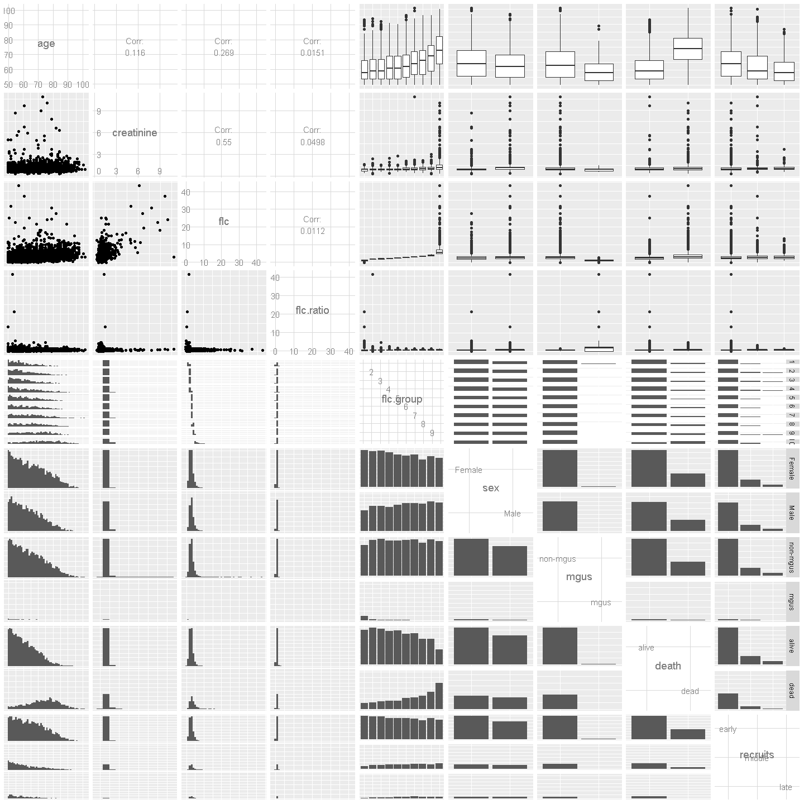

The ggpairs function helped to show an overview of the relationship between variables and to calculate the correlation between numerical values.

``` r
# Relation between MGUS and FLC ratio (log)
ggplot(data, aes(mgus, log(flc.ratio))) +
  geom_boxplot()
```

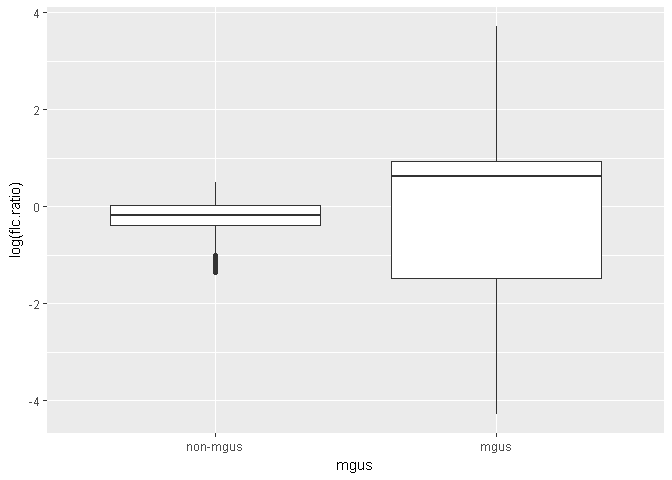

``` r
# Summaries of FLC ratio by MGUS
by(data$flc.ratio, data$mgus, summary)
```

    ## data$mgus: non-mgus
    ##    Min. 1st Qu.  Median    Mean 3rd Qu.    Max. 
    ##  0.2600  0.6800  0.8425  0.8577  1.0190  1.6483 
    ## -------------------------------------------------------- 
    ## data$mgus: mgus
    ##     Min.  1st Qu.   Median     Mean  3rd Qu.     Max. 
    ##  0.01389  0.22965  1.86401  2.34737  2.56546 40.87760

Focusing on the first objective, to test FLC as a marker for MGUS.
This graph shows that the average FLC ratio in people with the disease is higher than in those who don't have.
However it seems that smaller FLC ratios can also be a indicator.

``` r
# Relation between MGUS and FLC ratio (log) with references
ggplot(data, aes(mgus, log(flc.ratio))) +
  geom_point() +
  geom_hline(yintercept = c(log(.26), log(1.65)),
             size       =.1)
```

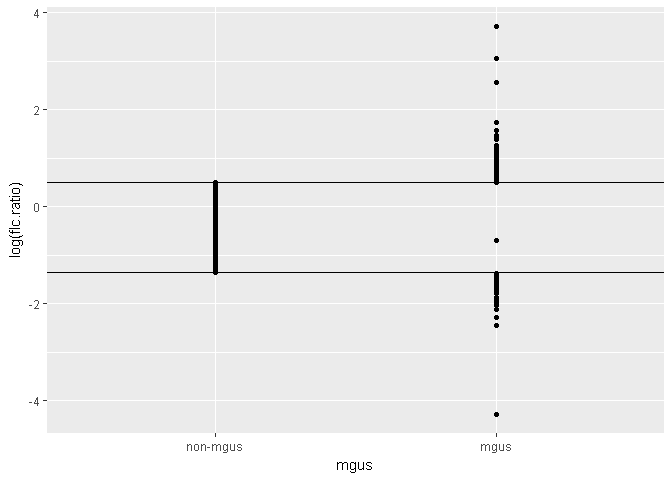

Geom graph was changed to point and FLC ratio references from Mayo Clinic were marked (0.26-1.65).
Most part of mgus one is outside the reference normal range.
However, there is a point inside.

``` r
# Relation between MGUS and FLC ratio (log) with references
ggplot(data, aes(mgus, log(flc.ratio), color = mgus)) +
  geom_point(alpha = .2,
             size  = .5) +
  geom_hline(yintercept = c(log(.26), log(1.65)),
             size       = .1) +
  scale_color_manual(values = c("#ffcc66", "#cc00ff"))
```

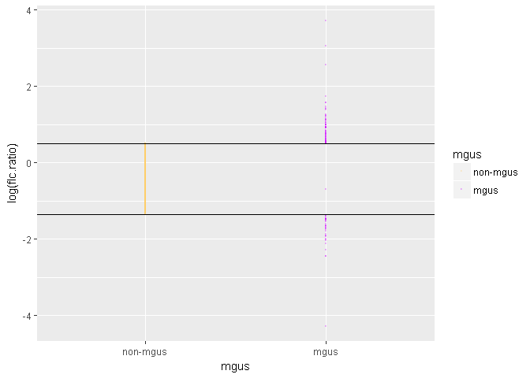

``` r
by(cut(data$flc.ratio, breaks = c(0, .259, 1.65, 50)), data$mgus, table)
```

    ## data$mgus: non-mgus
    ## 
    ##    (0,0.259] (0.259,1.65]    (1.65,50] 
    ##            0         7759            0 
    ## -------------------------------------------------------- 
    ## data$mgus: mgus
    ## 
    ##    (0,0.259] (0.259,1.65]    (1.65,50] 
    ##           36            1           78

The above graph shows that FLC can rather be an MGUS marker in most cases.
For values greater or less than the reference.
It is noteworthy that there is a point inside the normal range.
Which may represent an exception to the test or a bad value.

``` r
# Relation between epoch and FLC ratio (log)
ggplot(data, aes(recruits, log(flc.ratio))) +
  geom_boxplot()
```

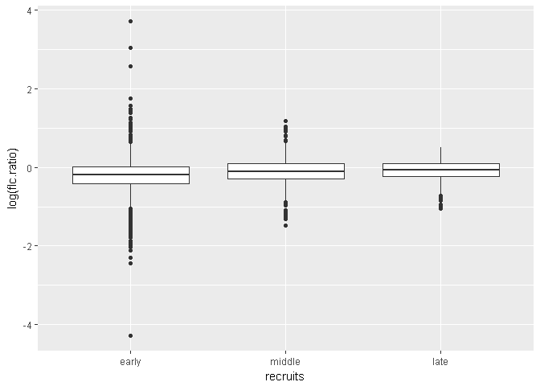

``` r
# Relation between epoch and FLC level (log)
ggplot(data, aes(recruits, log(flc))) +
  geom_boxplot()
```

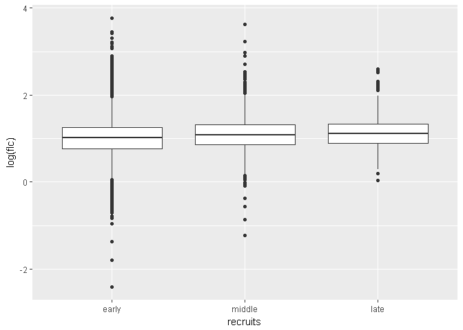

``` r
# Summaries of FLC ratio and level by recruits
by(data[, c("flc.ratio", "flc")], data$recruits,  summary)
```

    ## data$recruits: early
    ##    flc.ratio             flc        
    ##  Min.   : 0.01389   Min.   : 0.090  
    ##  1st Qu.: 0.65838   1st Qu.: 2.162  
    ##  Median : 0.82474   Median : 2.750  
    ##  Mean   : 0.86135   Mean   : 3.080  
    ##  3rd Qu.: 1.00642   3rd Qu.: 3.490  
    ##  Max.   :40.87760   Max.   :43.000  
    ## -------------------------------------------------------- 
    ## data$recruits: middle
    ##    flc.ratio           flc        
    ##  Min.   :0.2288   Min.   : 0.293  
    ##  1st Qu.:0.7424   1st Qu.: 2.350  
    ##  Median :0.9019   Median : 2.930  
    ##  Mean   :0.9383   Mean   : 3.323  
    ##  3rd Qu.:1.0910   3rd Qu.: 3.760  
    ##  Max.   :3.2508   Max.   :37.200  
    ## -------------------------------------------------------- 
    ## data$recruits: late
    ##    flc.ratio           flc        
    ##  Min.   :0.3528   Min.   : 1.033  
    ##  1st Qu.:0.7964   1st Qu.: 2.430  
    ##  Median :0.9407   Median : 3.020  
    ##  Mean   :0.9592   Mean   : 3.328  
    ##  3rd Qu.:1.1006   3rd Qu.: 3.770  
    ##  Max.   :1.6482   Max.   :13.520

Moving to point two, the differences between early, mid, and late recruits.
It's apparent that the FLC ratio and levels means are close among the classifications.
However, the range of values and the number of outliers decreased over time.

``` r
# Relation between Groups and FLC level (log)
ggplot(data, aes(flc.group, log(flc))) +
  geom_boxplot()
```

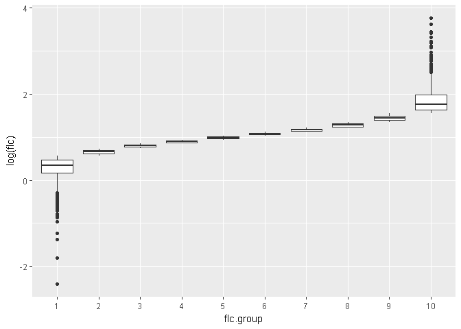

``` r
data %>% 
  group_by(flc.group) %>% 
  summarise(flc.min = min(flc),
            flc.max = max(flc))
```

    ## # A tibble: 10 x 3
    ##    flc.group flc.min flc.max
    ##    <fct>       <dbl>   <dbl>
    ##  1 1          0.0900    1.75
    ##  2 2          1.75      2.08
    ##  3 3          2.08      2.33
    ##  4 4          2.33      2.55
    ##  5 5          2.55      2.80
    ##  6 6          2.81      3.06
    ##  7 7          3.07      3.37
    ##  8 8          3.38      3.85
    ##  9 9          3.86      4.71
    ## 10 10         4.72     43.0

On objective 3, to study the association between FLC and higher death rates.
As the name suggests, each group of flc.group represents a range of FLC level.
The groups are organized from lower levels to higher levels.

``` r
# Distribution by Groups and Deaths
ggplot(data, aes(flc.group, fill = death)) +
  geom_bar()+
  scale_fill_manual(values = c("#00ff00", "#ff0000"))
```

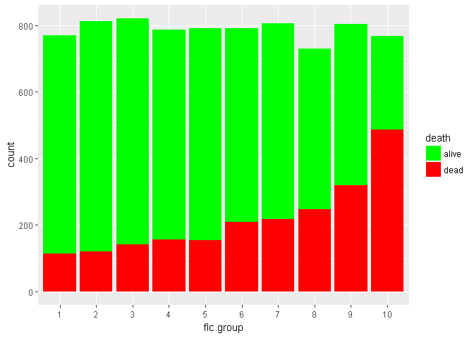

Since FLC groups has similiar count and looking to the plot.
Seems that higher FLC levels are associated with higher death rates.
As informed on dataset details.

``` r
# Aggregated dataset of FLC levels and death rates
flc.death <- data %>%
  group_by(flc.group) %>%
  summarise(flc.mean   = mean(flc),
            death.rate = sum(death == 'dead') / n())
flc.death
```

    ## # A tibble: 10 x 3
    ##    flc.group flc.mean death.rate
    ##    <fct>        <dbl>      <dbl>
    ##  1 1             1.34      0.150
    ##  2 2             1.94      0.149
    ##  3 3             2.21      0.173
    ##  4 4             2.45      0.198
    ##  5 5             2.68      0.195
    ##  6 6             2.93      0.265
    ##  7 7             3.21      0.270
    ##  8 8             3.59      0.340
    ##  9 9             4.24      0.397
    ## 10 10            6.89      0.634

``` r
cor(flc.death$flc.mean, flc.death$death.rate)
```

    ## [1] 0.9877749

``` r
# Relation between FLC mean and Death rate.
ggplot(flc.death, aes(flc.mean, death.rate)) +
  geom_line()
```

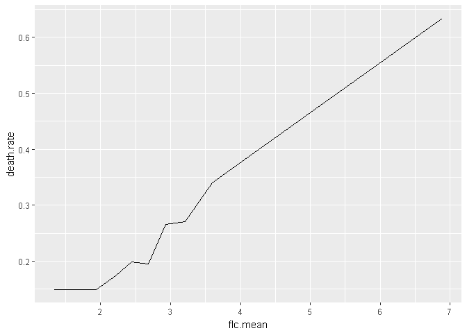

``` r
# Relation between FLC mean and Death rate with linear smooth.
ggplot(flc.death, aes(flc.mean, death.rate)) +
  geom_line() +
  geom_smooth(method = 'lm')
```

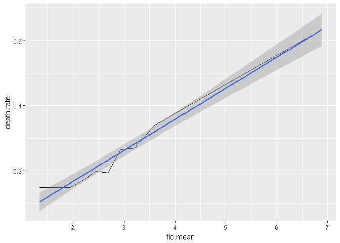

A new aggregate data set were created to confirm the hypothesis.
FLC means and death rate were calculated group by flc.group.
And there is a strong correlation between FLC level and death rates.

``` r
# Difference FLC level and creatinine correlation with or without log.
cor(log(data$flc), log(data$creatinine), use = "complete.obs")
```

    ## [1] 0.3821507

``` r
cor(data$flc, data$creatinine, use = "complete.obs")
```

    ## [1] 0.550158

Additionally, ggpairs showed a good correlation between FLC level and creatinine.
It suggests that higher levels of creatinine may raise FLC level.
In the next plots, log scale will not be used because it has influence on the correlation.

``` r
# Relation between FLC levels and creatinine without missing values
ggplot(subset(data, !is.na(creatinine)), aes(creatinine, flc)) +
  geom_point()
```

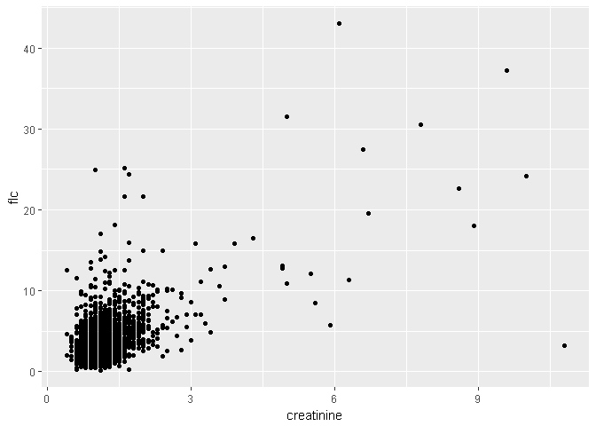

``` r
# Avoiding overplotation
ggplot(subset(data, !is.na(creatinine)), aes(creatinine, flc)) +
  geom_point(alpha = .1)
```

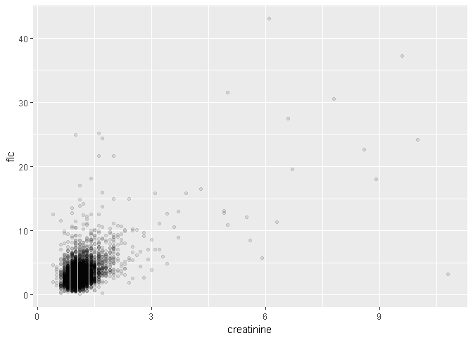

Missing creatinine rows were removed.
The first plot seemed to be overplotted.
An alpha parameter was add to solve this problem.

``` r
# Zoom in and linear regression line
ggplot(subset(data, !is.na(creatinine)), aes(creatinine, flc)) +
  geom_point(alpha = .1) +
  geom_smooth(method = 'lm') +
  coord_cartesian(xlim = c(0, 3),
                  ylim = c(0, 10))
```

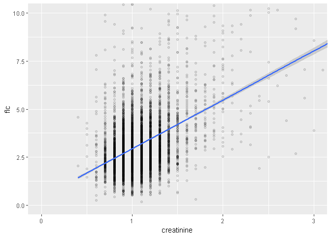

For a closer look, the graph was expanded where most of the points were.
A linear smooth line was added to represent the correlation.

``` r
# Relation between sex and creatinine (log)
ggplot(subset(data, !is.na(creatinine)), aes(sex, log(creatinine))) +
  geom_boxplot()
```

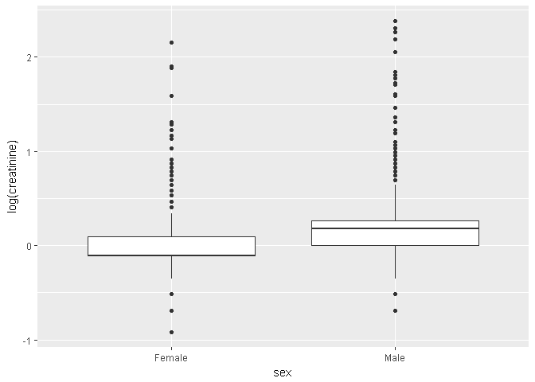

``` r
by(log(data$creatinine),data$sex, summary)
```

    ## data$sex: Female
    ##    Min. 1st Qu.  Median    Mean 3rd Qu.    Max.    NA's 
    ## -0.9163 -0.1054 -0.1054 -0.0385  0.0953  2.1518     758 
    ## -------------------------------------------------------- 
    ## data$sex: Male
    ##    Min. 1st Qu.  Median    Mean 3rd Qu.    Max.    NA's 
    ## -0.6931  0.0000  0.1823  0.1673  0.2624  2.3795     592

Analysing the relation between creatinine and sex.
The plot shows that, on avarage, males has more creatinine than females.
[Davita](https://www.davita.com/kidney-disease/overview/symptoms-and-diagnosis/what-is-creatinine?/e/4726 "creatinine") explain this difference.
As creatinine is related to a person muscle, females usually have lower creatinine levels than males.

``` r
# Relation between sex and FLC level (log)
ggplot(data, aes(sex, log(flc))) +
  geom_boxplot()
```

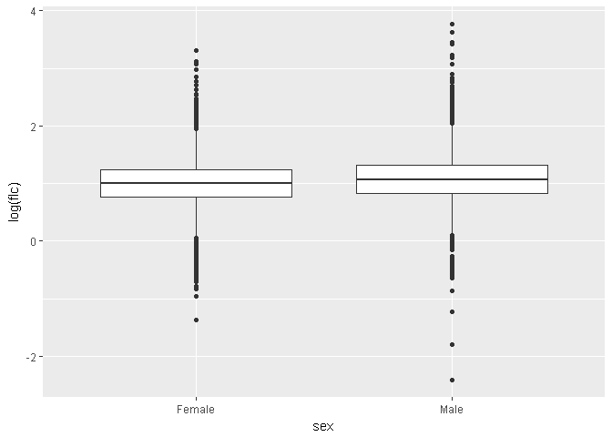

``` r
by(log(data$flc),data$sex, summary)
```

    ## data$sex: Female
    ##    Min. 1st Qu.  Median    Mean 3rd Qu.    Max. 
    ## -1.3744  0.7655  0.9969  1.0043  1.2355  3.3142 
    ## -------------------------------------------------------- 
    ## data$sex: Male
    ##    Min. 1st Qu.  Median    Mean 3rd Qu.    Max. 
    ## -2.4079  0.8257  1.0613  1.0778  1.3110  3.7612

As creatine has a good correlation with FLC levels.
A more difference between male and females means and quartiles was expected.
Thus, the hypothesis of the influence of sex on FLC levels should be explored.

------------------------------------------------------------------------

Bivariate Analysis
------------------

### Talk about some of the relationships you observed in this part of the investigation. How did the feature(s) of interest vary with other features in the dataset?

FLC levels are influenced by creatinine, both have a good and positive correlation.
MGUS may be indicated by abnormal FLC ratio, reported by Mayo Clinic.
Which was tested and confirmed in the analysis.
Death rates are indeed associated with FLC levels, as informed by the dataset details.
The mean FLC levels of a group has a stong correlation with it's death rate.
Late recruits have a more stable range of FLC levels and ratio.
Consequently, fewer people with MGUS.

### Did you observe any interesting relationships between the other features (not the main feature(s) of interest)?

Yes, creatinine has an interesting relationship with sex.
Since the mean creatinine in males is higher than in females.
Creatinine is important because it influences FLC levels.

### What was the strongest relationship you found?

The strongest relationship found was the mean FLC and the mortality rate.
They are positively and strongly correlated.
This correlation could be used in a model to predict the mortality rate of a group based on FLC levels.
By calculating the mean serum level of the group.

------------------------------------------------------------------------

Multivariate Plots
------------------

``` r
# Recruits, FLC ratios and MGUS relation
ggplot(data, aes(recruits, log(flc.ratio), color = mgus)) +
  geom_jitter(alpha = .2) +
  geom_hline(yintercept = c(log(.26), log(1.65)),
             size       = .1) +
  scale_color_manual(values = c("#ffcc66", "#cc00ff"))
```

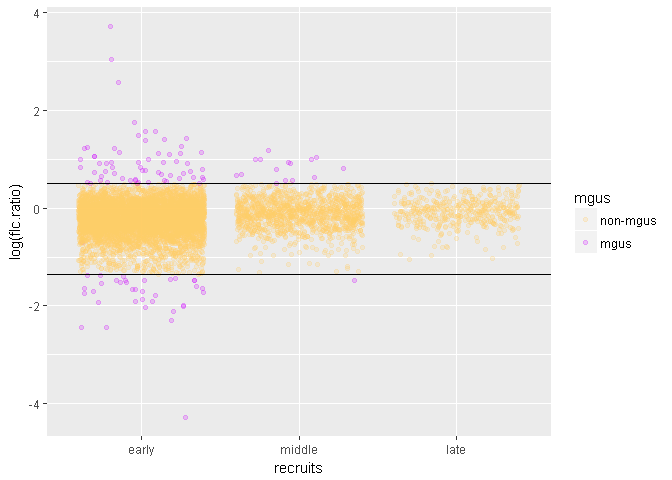

``` r
data$flc.ratio.range = cut(data$flc.ratio, breaks = c(0, .259, 1.65, 50))
with(data, ftable(mgus+recruits ~ flc.ratio.range))
```

    ##                 mgus     non-mgus              mgus            
    ##                 recruits    early middle late early middle late
    ## flc.ratio.range                                                
    ## (0,0.259]                       0      0    0    35      1    0
    ## (0.259,1.65]                 6048   1266  445     1      0    0
    ## (1.65,50]                       0      0    0    63     15    0

As expected, the number of people with MGUS descreased with time.
Because the FLC ratio of the samples becomed more stable the older the recruitments were.

``` r
# Creatinine, FLC and sex relation
ggplot(subset(data, !is.na(creatinine)),
       aes(creatinine, flc, color = sex)) +
  geom_point(alpha = .1) +
  geom_smooth(method = 'lm') +
  coord_cartesian(xlim = c(0, 3),
                  ylim = c(0, 10)) +
  scale_color_manual(values = c("#ff66cc", "#00ccff"))
```

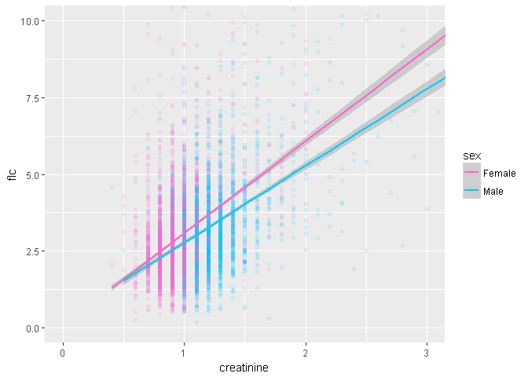

This plot shows that, although creatine influences FLC levels.
There is no certain of the relationship between sex and FLC.
Blue points are more on right than than the pink ones are, because creatine is on horizontal range. But both are mixed on vertical range, since male and female have similar boxplots, excluding outliers.

``` r
# FLC groups, FLC levels and deaths relation
ggplot(data, aes(flc.group, log(flc), color = death)) +
  geom_jitter(alpha = .1) +
  scale_color_manual(values = c("#00ff00", "#ff0000"))
```

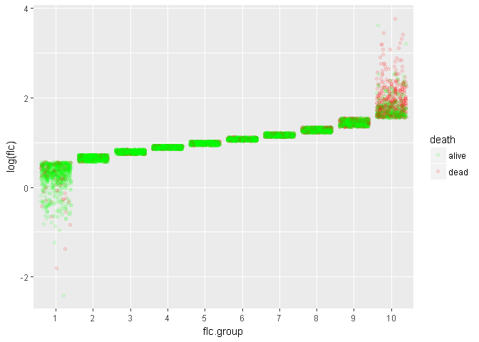

``` r
data %>% 
  group_by(flc.group) %>% 
  summarise(flc.min = min(flc),
            flc.max = max(flc),
            death.rate = sum(death == 'dead') / n())
```

    ## # A tibble: 10 x 4
    ##    flc.group flc.min flc.max death.rate
    ##    <fct>       <dbl>   <dbl>      <dbl>
    ##  1 1          0.0900    1.75      0.150
    ##  2 2          1.75      2.08      0.149
    ##  3 3          2.08      2.33      0.173
    ##  4 4          2.33      2.55      0.198
    ##  5 5          2.55      2.80      0.195
    ##  6 6          2.81      3.06      0.265
    ##  7 7          3.07      3.37      0.270
    ##  8 8          3.38      3.85      0.340
    ##  9 9          3.86      4.71      0.397
    ## 10 10         4.72     43.0       0.634

This plot displays a consolidated view.
It is possible to see the FLC levels by group.
And that high levels of FLC result in higher numbers of deaths.

------------------------------------------------------------------------

Linear Model
------------

``` r
# Modeling with linear regression
model <- lm(death.rate ~ flc.mean, flc.death)
summary(model)
```

    ## 
    ## Call:
    ## lm(formula = death.rate ~ flc.mean, data = flc.death)
    ## 
    ## Residuals:
    ##       Min        1Q    Median        3Q       Max 
    ## -0.038104 -0.012851 -0.005868  0.014741  0.044709 
    ## 
    ## Coefficients:
    ##              Estimate Std. Error t value Pr(>|t|)    
    ## (Intercept) -0.022294   0.018454  -1.208    0.262    
    ## flc.mean     0.095139   0.005308  17.922 9.63e-08 ***
    ## ---
    ## Signif. codes:  0 '***' 0.001 '**' 0.01 '*' 0.05 '.' 0.1 ' ' 1
    ## 
    ## Residual standard error: 0.02477 on 8 degrees of freedom
    ## Multiple R-squared:  0.9757, Adjusted R-squared:  0.9727 
    ## F-statistic: 321.2 on 1 and 8 DF,  p-value: 9.63e-08

A linear model was created to predict the death rate of a group based on the mean FLC.
A great R² was obtained.

``` r
# Testing model
set.seed(7874)
data.sample <- data[sample(1:nrow(data), 1000), ]
mean(data.sample$flc)
```

    ## [1] 3.104338

``` r
sum(data.sample$death == 'dead') / length(data.sample$death)
```

    ## [1] 0.276

``` r
predict(model, data.frame(flc.mean = mean(data.sample$flc)))
```

    ##         1 
    ## 0.2730489

In this part, the model was tested.
For the seed, the nuber of observations in the dataset was chosen.
A sample with 1000 people was generated and the number of deaths calculated.
The model was very close to the target.
The forecast was 273 and the result 276 (with this seed).
However, the value predicted is within the standard error of approximately 25 people.

------------------------------------------------------------------------

Multivariate Analysis
---------------------

### Talk about some of the relationships you observed in this part of the investigation. Were there features that strengthened each other in terms of looking at your feature(s) of interesting?

The plots of Recruits, FLC ratio, MGUS and FLC groups, FLC levels, Deaths.
Confirmed relationships already known in one graph, for a better visualization.
No surprise on those two.

### Were there any interesting or surprising interactions between features?

Even though creatine is on average higher in males than in females.
And, taking into account that creatine levels have a good correlation with the levels of FLC.
It was expected that FLC levels in males were on average significantly higher than in females too.
This situation was not reflected in the graphs.
Therefore, the hypothesis of the influence of sex on FLC levels was discarded.

### Did you create any models with your dataset? Discuss the strengths and limitations of your model.

Yes, a linear model to predict death rates on groups based on FLC levels was created.
With great R² of 97.57%.
And nice standard error of approximately 2.5%.

------------------------------------------------------------------------

Final Plots and Summary
-----------------------

### Plot One

``` r
# Plot one
ggplot(data, aes(recruits, log(flc.ratio), color = mgus)) +
  geom_jitter(alpha = .2) +
  geom_hline(yintercept = c(log(.26), log(1.65)),
             size       = .1) +
  scale_color_manual(values = c("#ffcc66", "#cc00ff"))+
  labs(title = "FLC as a MGUS marker",
       y     = "Log of FLC Ratio")
```

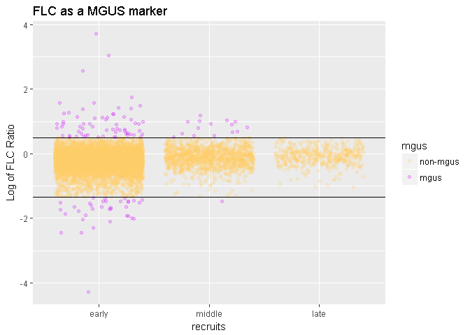

``` r
with(data, ftable(mgus+recruits ~ flc.ratio.range))
```

    ##                 mgus     non-mgus              mgus            
    ##                 recruits    early middle late early middle late
    ## flc.ratio.range                                                
    ## (0,0.259]                       0      0    0    35      1    0
    ## (0.259,1.65]                 6048   1266  445     1      0    0
    ## (1.65,50]                       0      0    0    63     15    0

### Description One

- [x] FLC as a MGUS marker.

The first question is about Dr. Robert Kyle study of MGUS.
The study suggested FLC as a possible marker for the disease.
This is why this question is important and why this plot was selected first.
This confirms the Mayo Clinic report as well.
That MGUS may be indicated by abnormal FLC rate.
The normal FLC ratio is a value between 0.26-1.65, according to the clinic report.
Values above and below this range mark the disease.
An exception was encountered, but it is probably a bad value or an exception.

### Plot Two

``` r
# Plot two
ggplot(data, aes(recruits, (..count.. / sum(..count..)),
                            color = I('black'),
                            fill  = I('#ffff00'))) +
  geom_bar() +
  scale_y_continuous(breaks = seq(0, 1, .05)) +
  labs(title = "Difference between early, mid, and late recruits",
       y     = 'Density') 
```

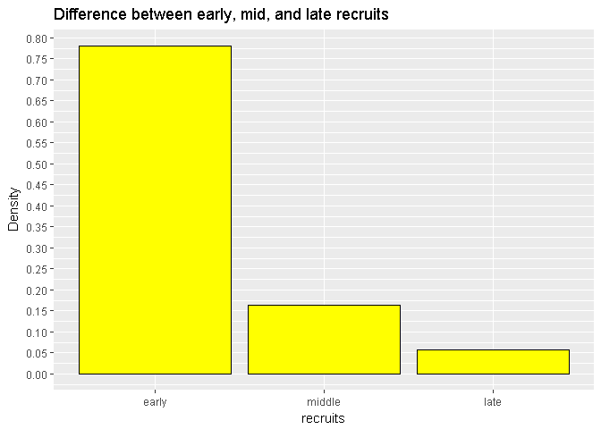

### Description Two

- [x] Differences between early, mid, and late recruits.

This second question was suggested by the dataset details.
That is, if there are differences between early, mid, and late recruits.
Most graphs of recruits shows the stabilization of sera, the older the recruitments were.
But the biggest difference is in density.
Since early recruits represents almost 80% of the total.

### Plot Three

``` r
# Plot three
ggplot(data, aes(flc.group, log(flc), color = death)) +
  geom_jitter(alpha = .1) +
  scale_color_manual(values = c("#00ff00", "#ff0000")) +
  labs(title = 'Association between FLC and higher death rates',
       y     = 'Log of FLC level',
       x     = 'Groups')
```

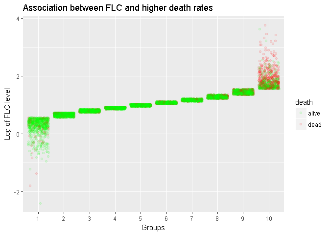

``` r
data %>% 
  group_by(flc.group) %>% 
  summarise(flc.min = min(flc),
            flc.max = max(flc),
            death.rate = sum(death == 'dead') / n())
```

    ## # A tibble: 10 x 4
    ##    flc.group flc.min flc.max death.rate
    ##    <fct>       <dbl>   <dbl>      <dbl>
    ##  1 1          0.0900    1.75      0.150
    ##  2 2          1.75      2.08      0.149
    ##  3 3          2.08      2.33      0.173
    ##  4 4          2.33      2.55      0.198
    ##  5 5          2.55      2.80      0.195
    ##  6 6          2.81      3.06      0.265
    ##  7 7          3.07      3.37      0.270
    ##  8 8          3.38      3.85      0.340
    ##  9 9          3.86      4.71      0.397
    ## 10 10         4.72     43.0       0.634

### Description Three

- [x] Association between FLC and higher death rates.

The third question is about Dr. Angela Dispenzieri and colleagues assay and discover.
About the association between FLC and higher death rates.
Which according to them were in fact associated.
This plot confirms the assay.
Showing that the number of deaths increases as the FLC level increases.

------------------------------------------------------------------------

Conclusion
----------

### Reflection

This document intends to make an exploratory data analysis on flchain dataset, present in the survival library.
The dataset represents the serum free light chain assay for 7874 subjects and 11 variables.
From a study of the relationship between serum free light chain (FLC) and mortality.
Three questions were initially selected to be answered by the analysis.

Along the study, univariate, bivariate, and multivariate analysis were executed. Plotting data and commenting about them to try to get answers and new questions.
For the study, the data needed to undergo some transformations.
Variables were created and some were changed in their data type.

The assay was enriched with help from Mayo Clinic reports and references about MGUS and FLC.
Davita's explanation about creatinine was also very helpful.
These references were essential to the success of the assay.

All initial question were answered successfully.
And some questions that came up in the middle of the analysis were taken into account.
Like the influence of sex on FLC levels, because of the relationship with these two and creatinine.

A predictive model, using linear regression, was created.
The purpose of the model was to predict for a new group of observations.
What would be the death rate of the sample?
As a result, the model presented good values for R² and Standard error.

The dataset details do not provide the units of the variables.
That was one of the difficulties of the analysis.
Some units are intuitive, but others are not.
This type of information is very important for comprehension and possible data transformations.
In addition, they are necessary for a better understanding of the graphs.
With this in view, no units were inserted in the graphs, to avoid wrong information.

The suvival of the observation and the primary causes of death were not explored.
These features may be important for another type of analysis.
And they could be used in futures projects.

------------------------------------------------------------------------

References
----------

1.  <https://github.com/MwillianM/Udacity/blob/master/OpenStreetMapDataWrangling/>
2.  <https://vincentarelbundock.github.io/Rdatasets/datasets.html>
3.  <https://google.github.io/styleguide/Rguide.xml>
4.  <https://www.rdocumentation.org/>
5.  <https://stat.ethz.ch/R-manual/R-devel/library/survival/html/flchain.html>
6.  <https://s3.amazonaws.com/content.udacity-data.com/courses/ud651/diamondsExample_2016-05.html>
7.  <https://www.mayoclinic.org/diseases-conditions/mgus/symptoms-causes/syc-20352362>
8.  <https://www.mayomedicallaboratories.com/test-catalog/Clinical+and+Interpretive/84190>
9.  <https://www.davita.com/kidney-disease/overview/symptoms-and-diagnosis/what-is-creatinine?/e/4726>
10. <https://www.w3schools.com/colors/colors_picker.asp>
11. <https://www.udacity.com/>
